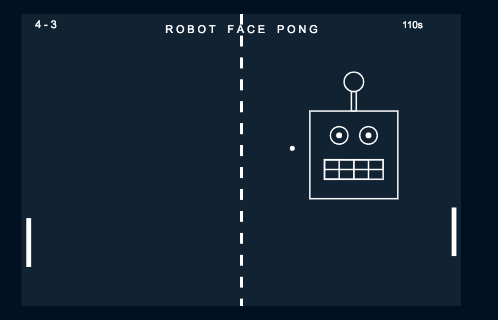

# Robot Face Pong

A single player pong game. Play against increasingly competitive versions of a reinforcement learning AI, implemented with TensorFlow.

## Motivation
This project was undertaken as part of the Makers Academy Software Developer course. We decided to make an AI as our final project to stretch ourselves and learn as much as possible in the two weeks.

A short description of the motivation behind the creation and maintenance of the project. This should explain why the project exists.

## Build status
Robot Face Pong - The pong game with AI opponent is currently deployed at https://robot-face-pong.herokuapp.com/. Travis is being used to ensure that only high quality code is deployed.

Build status of continus integration i.e. travis, appveyor etc. Ex. -

Build Status Windows Build Status

## Code style
If you're using any code style like xo, standard etc. That will help others while contributing to your project. Ex. -

js-standard-style

## Screenshots



## Tech

### Languages

Python - AI training
Javascript - front end game UI

### Frameworks

TensorFlow - for building a neural network
Keras - converted our Python neural network into javascript
TensorFlowJS - allowed us to store our neural network that had been converted from Python
expresJS - hosting our front end game, hosting an API that uploaded different AI models


## Features

- You can select various versions of AI to play against, ranging from random to 'better than random'.
- Time counts down as you play
- It will keep track of scores as you play

## Installation

#### Play Pong

to run the game of pong on your localhost, follow these steps from the root of the repo on the CL:
```
$ npm install
$ npm start
```
Then go on to http://localhost:3000 in browser.

#### Train your AI

Many of the python requirements can be found in the `python_instructions.md` file. In order to set your AI running, first install the correct version of Python:
```
brew unlink python
brew install https://raw.githubusercontent.com/Homebrew/homebrew-core/f2a764ef944b1080be64bd88dca9a1d80130c558/Formula/python.rb
```
then navigate to the /neural/ directory and install the requirements
```
pip3 install -r requirements.txt
```
Finally to set your AI running:
```
python3 run_training.py
```

If you open up the run_training.py file you'll be able to see many different variables that control different aspects of how the AI learns. Feel free to adjust them yourself in an attempt to get a smarter AI.

## API Reference

The API that holds all of our TensorFlowJS AI models can be found in this repository https://github.com/camjw/RobotPongAPI. The url for model 0 is https://burninglake.herokuapp.com/model/version_0 and in the same way you can find model 1, model 2, etc.

## Tests

The javascript tests are all written using jest, to see all tests as well as test coverage enter the following command:
```
npm test
```

All python tests have been written using Unittest, to run the tests navigate to the /neural folder and run the following command:
```
coverage run --source=lib -m unittest && coverage report
```


## How to use?
If people like your project they’ll want to learn how they can use it. To do so include step by step guide to use your project.

## Contribute
We welcome contributions to this project.
Please:
Open a pull request
Your pull request will then be reviewed from one of the project collaborators and we will try to respond quickly
If you have any suggestions, or notice any bugs, please open an issue

Let people know how they can contribute into your project. A contributing guideline will be a big plus.

## Credits
Give proper credits. This could be a link to any repo which inspired you to build this project, any blogposts or links to people who contrbuted in this project.

## By
- [Jonathan Andrews](https://github.com/JonathanAndrews)
- [James Rodney](https://github.com/jlrodney)
- [Cameron Whitehead](https://github.com/camjw)
- [Aidan Faria](https://github.com/NadiaAiraf)

## License
A short snippet describing the license (MIT, Apache etc)

MIT © Yourname
